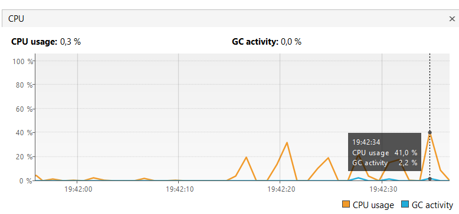
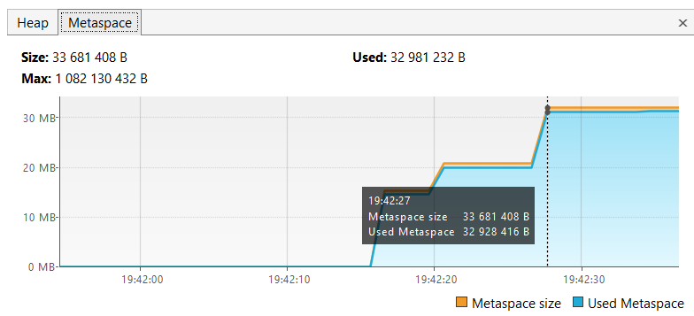
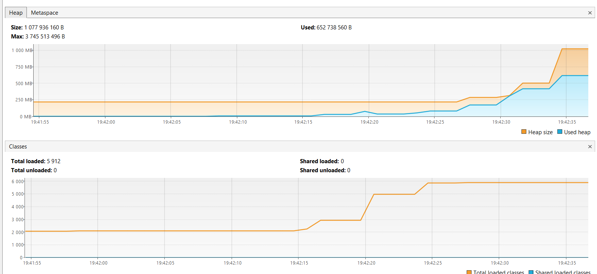

Вкладка Монитор - показывает время безотказной работы процесса и базовую телеметрию: загрузку ЦП, использование кучи и метапространства, количество загруженных классов и количество текущих и запущенных потоков.

Потребление CPU имеет скачки до 41% и GC до 2.2%.

На вкладке Marketspace видно, что размер очень близок  к верхней границе.

В один из моментов времени размеры кучи доступный и используемый, достигли единого объема, после чего была выделена дополнительная память

 

Так же на графиках кучи и классов хорошо прослеживается зависимость увеличения количества классов от размера кучи.

 